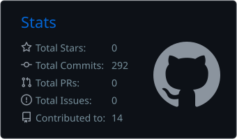
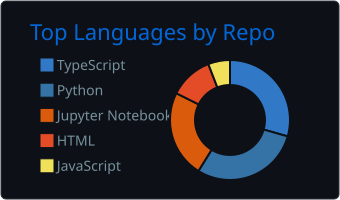
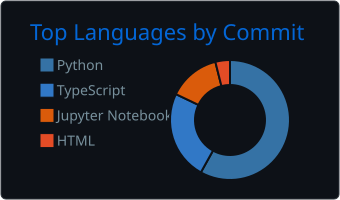

 

---

## 👋 About

I build machine-learning systems that run **live**, not just in notebooks: streaming pipelines, GPU inference, agent frameworks you can replay and audit, and dashboards that make the output usable. B.Tech student at VIT.

I report results the way they came out. The drone project below missed its own 0.88 mAP target, and the README says so.

## 🚀 Flagship projects

Each one has passing CI and a tagged release.

| | Project | What it is | Evidence |
|---|---|---|---|
| 🛡️ | [**RT-GIDS**](https://github.com/Veladicodes/Real-Time-GPU-Based-Intrusive-Detection-System)     | Real-time network intrusion detection: XGBoost detector, FastAPI backend, Next.js dashboard with a 3D threat globe and SHAP explainability | 33 backend tests, TypeScript typecheck, production build and Docker build on every push |
| 🧭 | [**Deterministic Agent Orchestration**](https://github.com/Veladicodes/deterministic-agent-orchestration-mega-ai)     | Multi-agent pipeline (decomposer, retriever, critic, synthesizer) where every run produces a replayable trace and a SHA-256 execution hash | 123 tests; replay compare and validate endpoints; a React replay/diff view |
| 🔍 | [**Real-Time Fake Job Detector**](https://github.com/Veladicodes/Realtime-Fake-Job-Predictor)     | Streaming pipeline that flags fraudulent job postings as they arrive: Kafka, Spark, PostgreSQL, FastAPI, Next.js | F1 **75.6%**, precision **82.3%**, recall **70.0%** on data with 4.8% fraud, with the threshold tuned on a validation split |
| 🔥 | [**Drone Fire Detection with RAG**](https://github.com/Veladicodes/cloud-rag-drone-fire-detection)     | YOLO edge detection feeding a FAISS-backed RAG pipeline that drafts cited response plans for wildfire responders | mAP@0.5 **0.733** (the 0.88 target was not met), about 73 ms detect-to-plan with a mock LLM, about 198 messages/s across 10 simulated drones |

Also: [**RetailSense Lite**](https://github.com/Veladicodes/RetailSense_Lite), retail demand forecasting with a Prophet, XGBoost and LightGBM ensemble, anomaly detection and a Streamlit dashboard.

## 🧰 Tech stack

## 📊 GitHub activity

 

---

  Open to ML / AI engineering internships and collaborations. Reach out on LinkedIn or by email.

